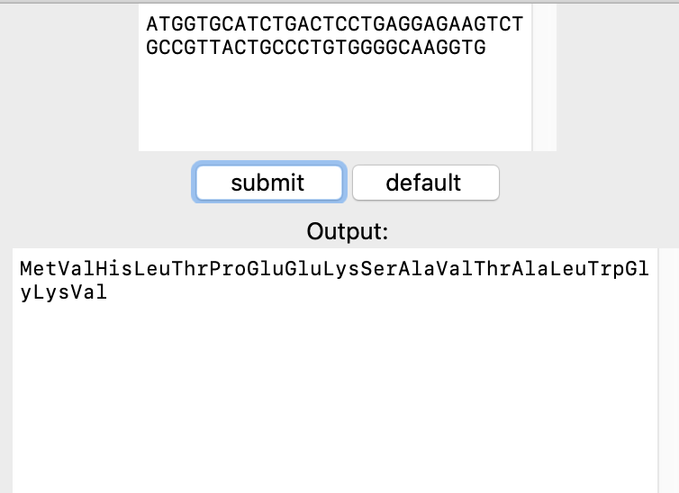
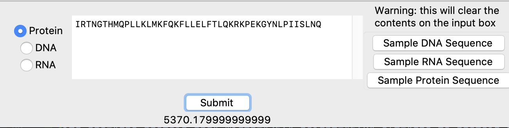
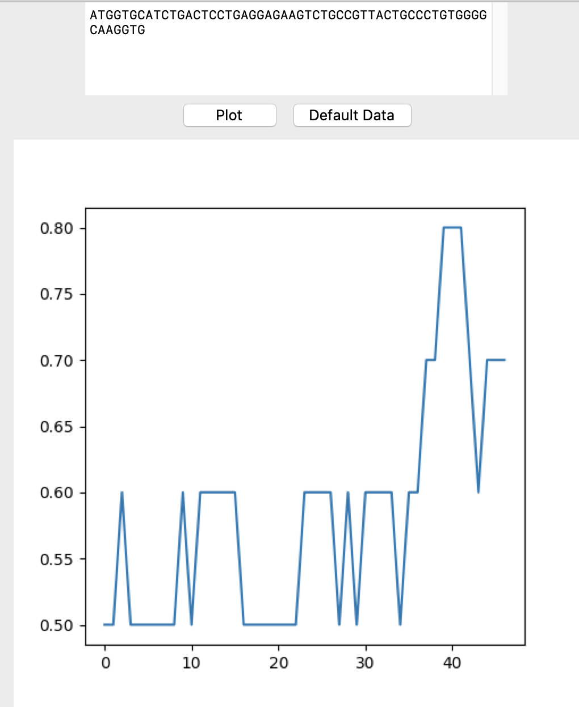
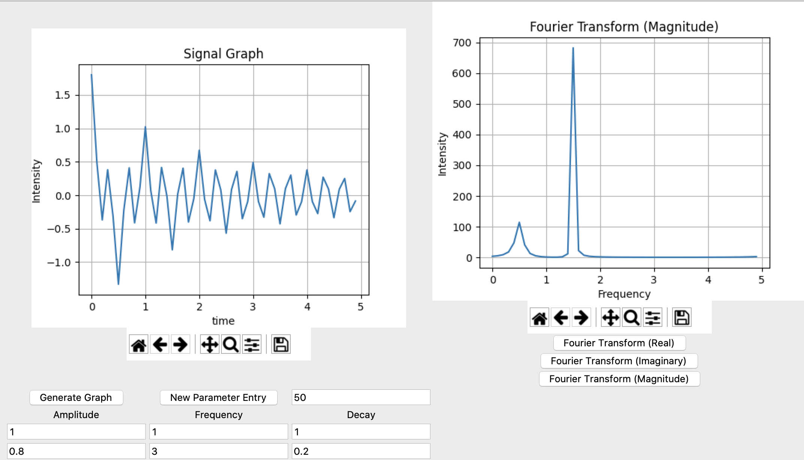

# BioTest View
A simple python tkinter application

## Table of Contents
* [General Info](#general-info)
* [DNA Sequence to Protein](#dna-to-protein-sequence)
* [Molecular Mass Estimator](#molecular-mass-estimator)
* [GC Content Plot](#gc-content-plot)
* [Image Editor](#image-editor)
* [Sequence Alignment](#sequence-alignment)
* [Signal](#signal)

## General Info
This python project consists of 6 different modules. Each module preforms a specific task, demonstrated within the name.

## DNA To Protein Sequence
This module accepts an input of DNA nucleotides, and converts the string into the corresponding amino acid sequence that it represents. 
The default button, will set the contents of the box to a predefined DNA sequence.

## Molecular Mass Estimator
This module accepts a string of either nucleotides or amino acids. The specific input type of DNA, RNA, or protein can 
be set. The module will then attempt to convert the string into the total mass, from the corresponding input type.
This module also provides 3 default inputs, one for DNA, one for RNA, and one for protein.

## GC Content Plot
This module accepts a string of nucleotides, then plots the relative density of GC within the region. 

## Image Editor
This module accepts a string representing the relative path to the image. The image can then have the color values altered,
or the image set to greyscale.

## Sequence Alignment
This module accepts two different strings, one in each input box. The user then defines whether the sequences should be 
compared as DNA, or protein sequences. There are two different comparison options provided, to compare either by similarity
or by alignment. Alignment will take into account the distance between regions of similarity.

## Signal
This module accepts parameters, an amplitude, frequency, and decay value, that is used to generate a graph showing the signal.
The user can input multiple parameters, to stack multiple signal together. The is also the option to show a fourier transform
of the data; showing the real component, imaginary, or the magnitude. 

